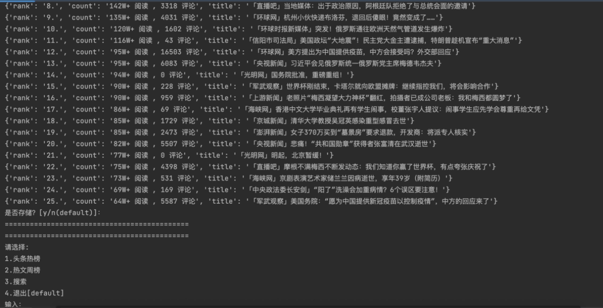
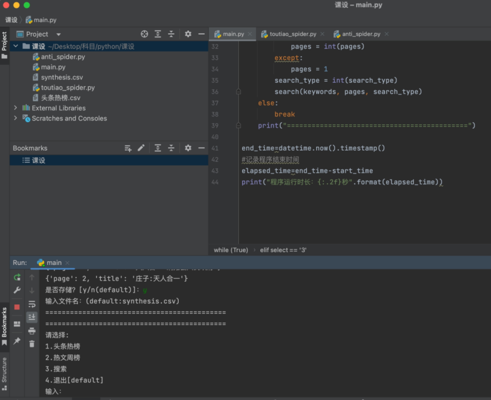
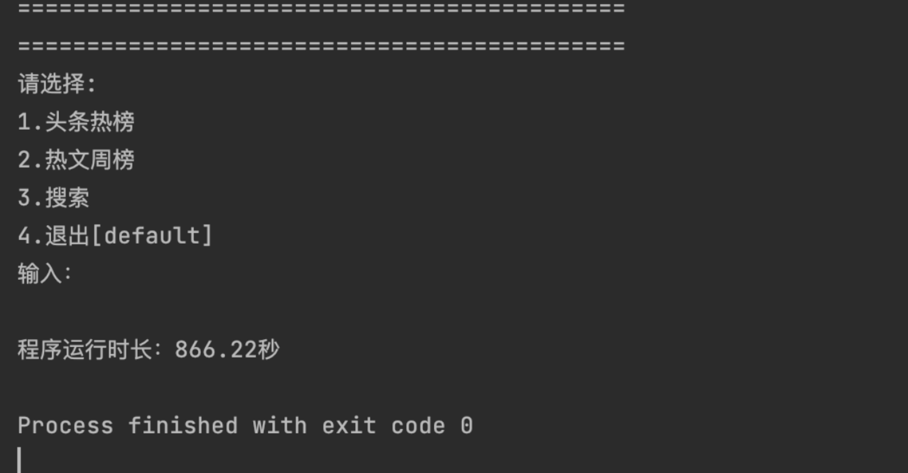

# Toutiao-crawler
 Toutiao-crawler;selenium;anti-crawling techniques

# 1.摘要abstract

**Abstract**：This paper presents a method for designing and implementing a theme crawler. The crawler is able to incrementally crawl the specified target website for relevant content, filter out the desired theme data, and save the cleaned data to an Excel or CSV file. The crawler consists of three modules: main.py, toutiao_spider.py, and anti_spider.py. Main.py is the entry point for the program, responsible for displaying options and calling functions in toutiao_spider.py; toutiao_spider.py is responsible for crawling and processing data; anti_spider.py is responsible for anti-crawling techniques. In addition, this paper also mentions using the request library to send requests, using the Get and Post methods to access the webpage, using selenium to operate the browser to access dynamic webpages, and using Beautifulsoup and regular expressions to parse webpage content.

**Key words**：crawler；selenium；anti-crawling techniques；Toutiao

**摘要**：本文提出了一种设计并实现主题爬虫的方法。该爬虫能够增量地爬取指定目标网站的相关内容，过滤出所需的主题数据，并将清洗后的数据保存到Excel或CSV文件中。该爬虫由三个模块组成：main.py、toutiao_spider.py和anti_spider.py。main.py是程序的运行入口，负责显示选项并调用toutiao_spider.py中的函数；toutiao_spider.py负责爬取和处理数据；anti_spider.py负责对抗反爬技术。此外，本文还提到了使用request库发送请求、使用Get和Post方式访问网页、使用selenium操作浏览器访问动态网页、利用Beautifulsoup和正则表达式解析网页内容等内容。

**关键词**：爬虫；selenium；对抗技术；今日头条

本程序由三个模块完成，分别是main.py、toutiao_spider.py、anti_spider.py。

main.py为程序运行入口，主要作用是显示选项、调用toutiao_spider.py中的函数。

toutiao_spider.py包含多个函数，这些函数用于爬取头条新闻，并进行数据的处理。

anti_spider.py负责对抗反爬技术：从池中随机抽取一个伪User-Agent并请求url。本爬虫设计框架图如下图所示：

爬虫设计框架图

# 2具体细节

## 2.1 main.py

包含有关时间的变量（如elapsed_time）用于处理计算程序运行时间。
包含有关选择的变量（如select）用于选择爬取的类型、设置爬取参数（如爬取的页数pages）、指定保存路径。

## 2.2 toutiao_spider.py

hot函数接受一个参数 `select`，表示要爬取的热榜类型。可以是今日头条的头条热榜（`select` 为 1）或热文周榜（`select` 为 2）。函数首先使用 `fake_useragent` 库的 `UserAgent` 类来生成伪装的 HTTP 请求头，然后使用 `requests` 库来发送请求并获取响应。接下来，函数使用 `BeautifulSoup` 库来解析网页内容，并清洗数据。具体来说，函数使用 `soup.select` 方法来选择需要提取的数据，然后逐条写入结果数组中。最后，函数根据热榜类型决定是否保存爬取的数据，如果需要保存，则提示用户输入文件名，并使用 `csv` 库将数据写入 CSV 文件中。
search函数接受三个参数：`keywords` 表示要搜索的关键词，`pages` 表示要爬取的页数，`search_type` 表示要爬取的数据类型。可以是综合数据、资讯数据或图片数据。根据搜索类型选择 `url` 中的参数 `pd` 的后缀，这个后缀决定了头条引擎的搜索类型。然后使用此 URL 发送请求并获取响应。然后，根据搜索类型选择爬取的方式：如果是图片，则调用 `atlas` 函数来爬取图片（可选择下载）；如果是综合数据或资讯数据，则调用 `synthesis` 或 `information` 函数来爬取相应的数据。最后，函数根据搜索类型决定是否保存爬取的数据，如果需要保存，则提示用户输入文件名，并使用 `csv` 库将数据写入 CSV 文件中。
synthesis函数用于在头条搜索引擎中进行综合搜索，并根据传入的页数从第一页到第pages页依次爬取搜索结果。它使用Selenium打开浏览器，并获取每页的标题，然后将标题存储在results数组中。
information函数用于在头条搜索引擎中进行资讯搜索，并根据传入的页数从第一页到第pages页依次爬取搜索结果。它使用Selenium打开浏览器，并获取每页的标题和内容，然后将标题和内容存储。
atlas函数用于爬取图片，其流程如下：1. 使用Selenium的webdriver打开头条搜索页面，并搜索图片类型的关键字。2. 通过XPATH定位，获取图片的标题和图片的src属性值。3. 使用requests模块，根据src属性值请求图片，并将图片下载到本地。4. 将图片的标题和src属性值存储到results数组中，并使用increment_save函数进行增量式爬取。5. 如果图片下载时出现异常，则中断图片下载并抛出异常。6. 完成图片的爬取。
increment_save函数实现了数据的去重，使爬虫增量爬取。该函数判断爬取内容是否出现在历史列表中，如果存在，则跳过此次爬取。

## 2.3 anti_spider.py

run函数接受一个url并使用伪User-Agent池，从中随机抽取一个值，使用requests库发送带有伪装用户代理字符串的 HTTP 请求，从而可以防止网站识别出请求来自爬虫程序，并返回响应对象。

## 2.4其他

此项目中许多函数设置了返回值，但在main函数中并未利用，这是因为在设计过程中，考虑了程序的可扩展性、可维护性：返回值的冗余便于在未来为项目添加返回值相关的新函数，为函数的使用者提供更多的灵活性。在某些情况下，函数的返回值可能会在调用函数的代码中被用来进行条件判断或其他操作。因此，即使主函数并不需要返回值，也有意义给函数设置返回值。
完整代码见“源码”文件夹。
更详细的细节见源代码注释。

# 3.示例

## 3.1头条热榜/热文周榜

### 3.1.1头条热榜

 

 

### 3.1.2热文周榜

 

 

## 3.2搜索

### 3.2.1综合搜索

 

 

### 3.2.2资讯

 

### 3.2.3图片

图片爬取及自动新建文件夹

 

图片文件夹 

### 3.3退出程序

键入任意键退出程序

 

# 4.小结

本爬虫程序，能够从今日头条的搜索引擎爬取指定主题的新闻、资讯、美图等数据，并将数据保存到本地。本次设计用到了Web与HTTP协议通信原理、Get和Post请求、CSV文件处理、数据清洗、Beautifulsoup、反爬绕过技术、增量爬取、selenium动态页面访问等技术。
